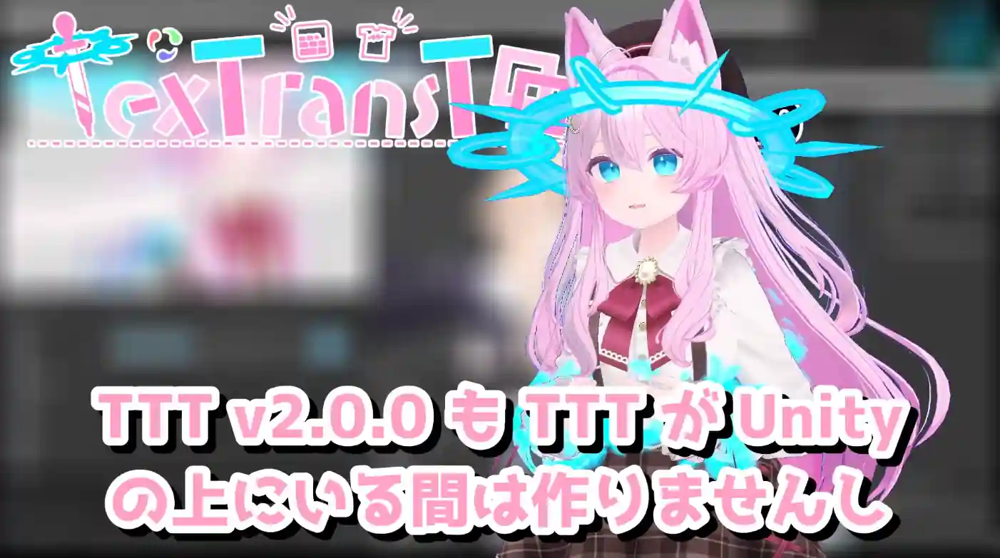

+++
date = '2026-01-01T21:12:35+0900'
title = '2025年と今年'
+++

## 新年

これを書いているのも、公開するのも1月の初めのほうだと思います。

あけましておめでとうございます！

そして フレンドの人たちも、[TexTransTool] をつかってくださってるみなさんも、特に関わりないけどこのブログ読んでる人も！

今年も Reina_Sakiria をよろしくね！

## はじめに

このブログは、技術的な話をするわけでもないから、いつも適当だけど、よりかなり適当に書き綴るのでよろしくね！

## 去年 (2025年) の大きめな思い出

### TexTransTool v1.0.0

振り返るにしてもまずは、表立っての活動で一番大きい [TexTransTool] の v0.9.0~v1.0.1 までの話。

そもそも TTT に関しては、 v1.0.0 をリリースしてからは活動を頻度を落としているのもあって、2025年の後半の方はあんまり何もしていないような ...

けど、かなり何度か TTT を v1.0.0 にしようとして出来ていない状態が、1年以上経過してしまっていたので、 v1.0.0 をリリースできて、一区切りつけれたのはとても良かった ... 去年は有言実行できたね！

### Arch Linux にメイン環境を移行した

[ここ](https://github.com/ReinaS-64892/VRCAvatarBuildServerTool/blob/47acb537a5a98ccecd92fddd44f76adcd41fc144/README.md#%E3%81%93%E3%82%8C%E3%81%AF%E3%81%AA%E3%81%9C%E4%BD%9C%E3%82%89%E3%82%8C%E3%81%9F)とか、[ここ](https://ttt.rs64.net/blog/2025/06/12/TTT-and-Linux)に、その果の記録を公開したように、メイン環境を移しました。

色々とあって、`Ryzen 9 3950X` と マザーボード一式を手に入れ、強力な PC をもう一代組めて、 OS を変えるには丁度いい機運があったんです。

けど、そのとき Windows をまた入れるのも面白くないですし、 Linux にある X11 や Wayland と呼ばれるウィンドウにまつわるプロトコルのことを聞いていて、 WindowManager の自由というのがとてもほしくなったので、それを機に、フレンドの力を借りながら Arch Linux を頑張ってインストールしました。

ちょっと大変だったけど、今だったら私一人でもできるのかな ... ？

最終的に [WayfireWM](https://github.com/WayfireWM/wayfire) に一旦落ち着いたのですが、既に慣れというものは恐ろしく Windows11 に戻らないといけない都合の時は、アプリのウィンドウを掴もうとしてよく事故るようになってしまいましたね ... ()

いずれ WaylandWindowManager を自ら自作してみたいものですね、WindowManager を選べるし作れる自由があるのだから！

そのために Linux に移住したのだからね！

ところで、Linux に移ってしまったせいで UnityEditor の取り回しが最悪になったのはまた別の話 ()

### 自由飛行技術の話

当初は名前すらつけてなかった Reina_Sakiria が普段使用している飛行技術。いまは 自由飛行技術 などと呼んでいます。

いつしかできるようになっていた、あの技術の源流となる技術は、2022年10月ごろに見つけていたのですが、2023年頃には今よりももっと低クオリティだけど核の技術は出来ていたはず ...

私が [OVR-AS](https://github.com/OpenVR-Advanced-Settings/OpenVR-AdvancedSettings) の Motion/Gravity Setting を見つけ出し、遊び始めた延長で今の形のクオリティまで発展する経緯があったのだけど、もう記憶がなく、詳細な日時はわからないね ... (その技術が私のとって都合がよく扱いやすかったということもあるが) 一年か半年くらい前からいつの間にか今のクオリティになっていた。

でも、ちょっとしたネタ、ちょっと便利なトリックぐらいのものが、それ単体で有用で実用的になったのは 2025年 の私の功績なのかも。

#### エルシオン

そう、それは8月頃、私がエルシオンちゃん集会(跡地)に訪れ、サンプルを使用して空を飛んで遊んでいたあの記録。

私が録画したものでもなければ、私のツイートでもなく、もうツイートは消えてしまったのでもうあの動画は見れない ... かなしいね。

けれど、その影響で、自由飛行技術が私の中だけで終わらない物にある程度できたのは非常に良かったとも思っています。

自由飛行技術は、「技術」。「ギミック」ではなく、フルトラできるアバターなら全アバター標準で使えます。

興味のある方は、「アバター」ではなく 「あなたの体と環境と設定」を改変して頑張ってみてね。

いずれこの技術に関する詳細なブログを書きたいと思っていますが、今のところ[これ](https://x.com/ReinaS_64892/status/1956225387182350485)ぐらいしか参考になるものはないかも。

これは私が自分で撮った動画



### Reina_Sakiria のアバターの話

そう！ Reina_Sakiria のアバター改変は最近結構色々変わったんですよ！

でもこの話長くなりそうなのでいずれ別でブログ書きたいな ... ここに書くには長過ぎる。

Linux 環境からの移住の影響から、TTT によって変わった私の改変や、私のアバター改変のためだけに作ったツールの話とか ... 誰かの参考にはなると思うし、書きたいね。

## 今年のこと

### あれ

今年の目標は一つだけあって、最近私が [TexTransTool] を放置して、開発している　あれ　を公開できるところまで持っていくこと以外特に考えていません。

その あれ というのは

<https://ttt.rs64.net/blog/2025/12/11/TTC#%E3%81%8A%E3%82%8F%E3%82%8A>
> でも、TexTransCore を作ったのには、裏のテーマ 以外にも、もう少し思惑があるのですが、それはまたいずれ

とか

<https://ttt.rs64.net/blog/2025/06/22/TTT-v1.0.0#%E6%AD%A3%E5%BC%8F%E3%83%AA%E3%83%AA%E3%83%BC%E3%82%B9%E3%81%A8%E4%BB%8A%E5%BE%8C>
>今後の、私自身の成長のため、とある思惑のため、TexTransTool ではないプロダクトの開発に既に着手しています。(それが表に出せるようになるには時間がかかりますが ...) それによって TexTransTool の開発ペースは今までのペースではなくなります。

とか

<https://www.youtube.com/watch?v=_E3Ps5SljbQ&t=31s>
> 

とかで、示唆している物、そのものなわけだけど ... 公開できるものになったとしても実用レベルの物に持っていくにも時間がかかりそう ...

いつか ... AGPL にて公開できる日を楽しみに、少しずつ開発を続けていこうと思います。

## おわり

大体振り返りになっちゃった、今年のことって書くことがないよ〜 ... 結構無計画人間かもしれない。

ん〜 でも いい縁 があったらいいな〜！ ()

私のことを AI だ！などと言い張る人もいるけど ...  AI でも 機械 でもないので、そんなちょっと人間らしいことを言ってみたり ... なんてね。

[TexTransTool]: https://ttt.rs64.net
