+++
date = '2026-01-11T22:58:20+0900'
title = '2025年頃・直近の私のアバター改変'
+++

## はじめに

これは、 Reina_Sakiria のアバター改変におけるワークフローとかそういう物を書き綴ったものになります。

(ほぼほぼ 備忘録 と行ってもいいかもしれないですが) とあるツール開発者のアバターの扱い様を見たいという人は、見ていってください。

## 私のアバター改変の方向性

Reina_Sakiria のアバター改変というのは、少し私と VRChat で私と話したりしたことがあるのならわかりやすい話だと思いますが、

私のアバター改変は「自分の理想の姿にする」とか、「かわいいを追い求めるとか」とか言うよりも、「様々なアバターを自分が扱えるように染める」と言ったほうが近いことをしています。

いくつかここに私のアバターのサムネイルの一部をピックして置いておきましょう。


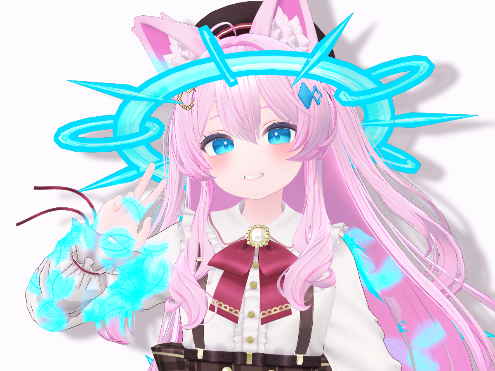
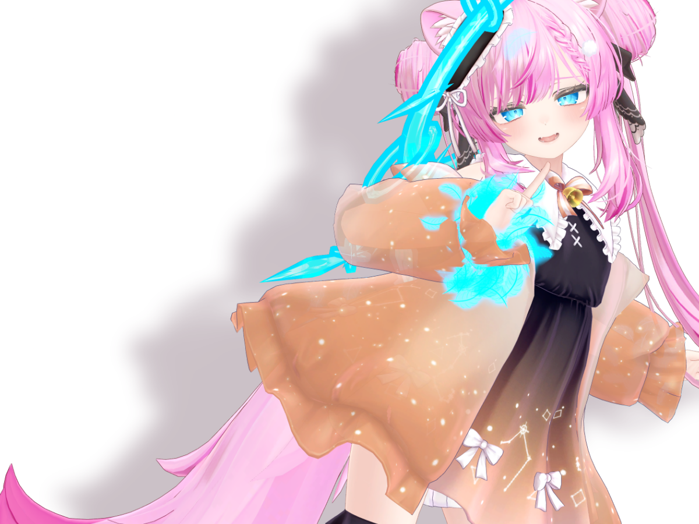
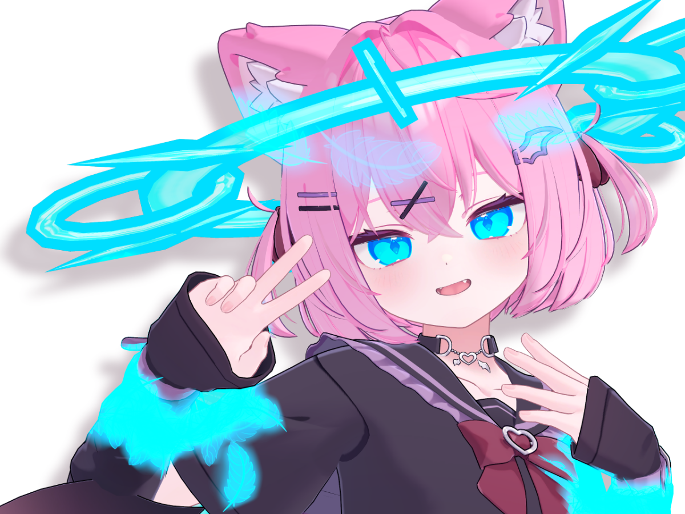
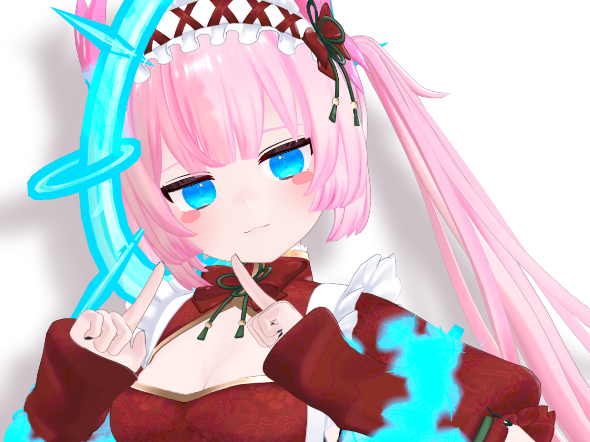
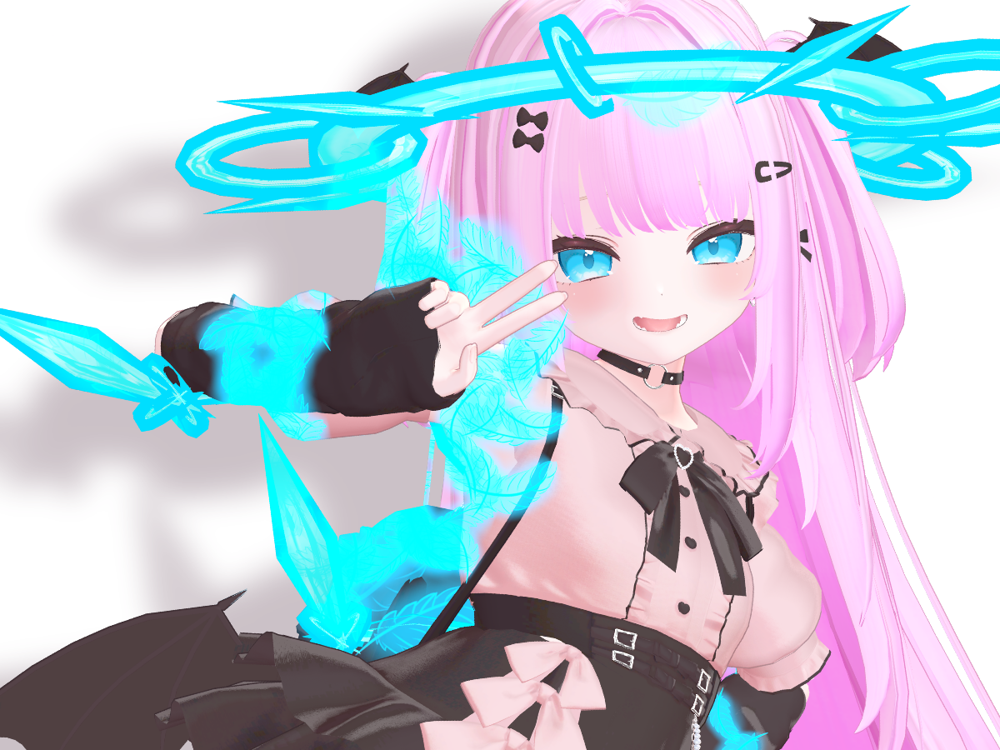
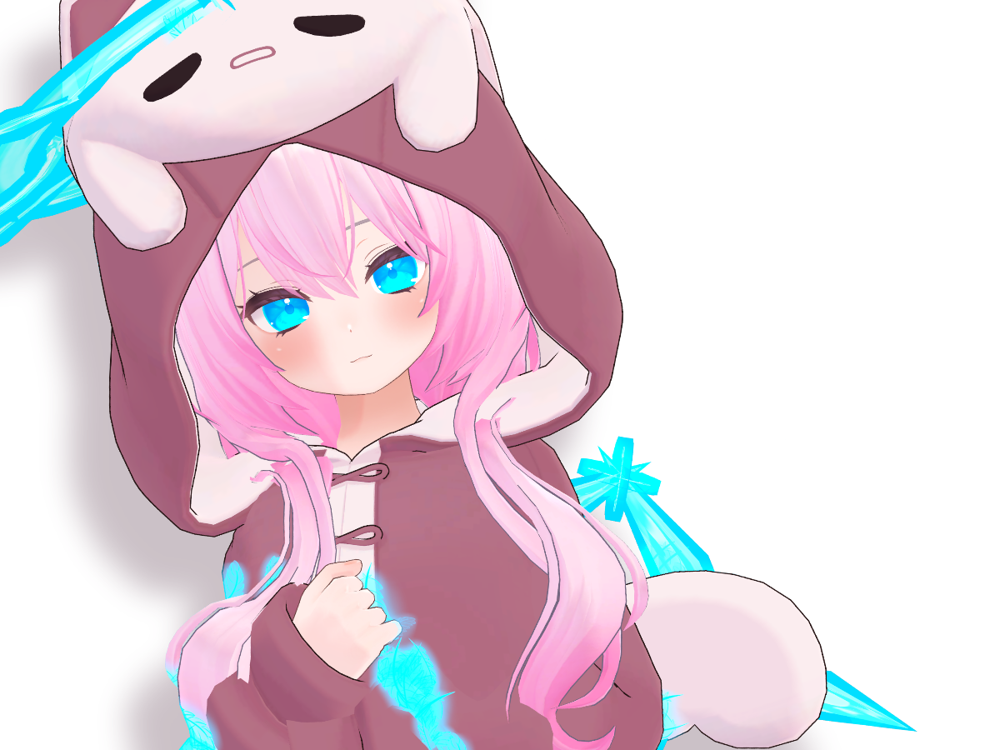
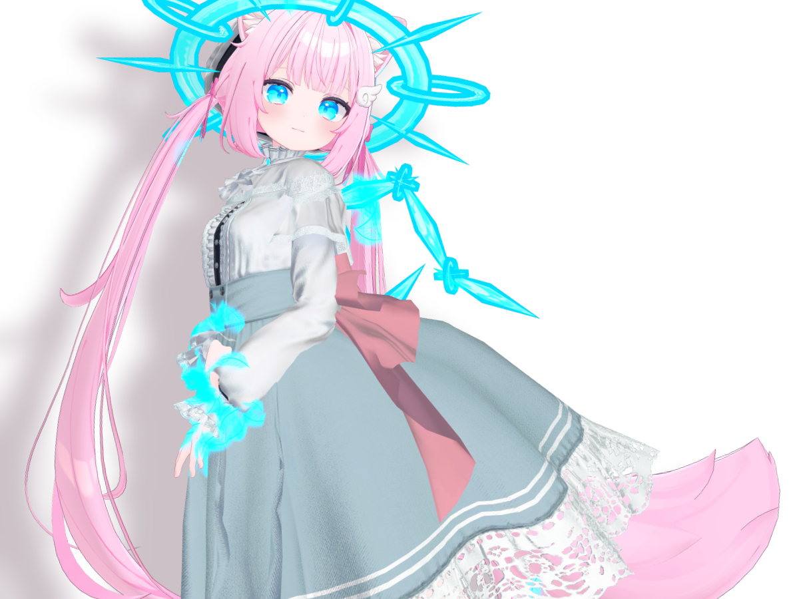


基本的に基底となるアバターをの雰囲気を保ち、[疑天使の操り用具] を取り付け、髪がピンク色に染められ瞳は青くなる。

... 少なくとも私の周辺の人間よりは何もしていない改変をしていると思います。

自ら作った非売品の アクセサリー(?) である [疑天使の操り用具] の存在を除くと本当にシンプルな色改変しか行っていないと言っても良いでしょう。

(少なくとも ... 見かけは)

## 改変の大まかな流れ

### [疑天使の操り用具]の取り付け

これは、全アバター共通で取り付けられるように作られたアクセサリーの塊のようなもの ()

全アバター共通でスケールを変えないルールで取り付けているので、光輪の取り付けには、頭周辺の状況によっては難航することも多い。

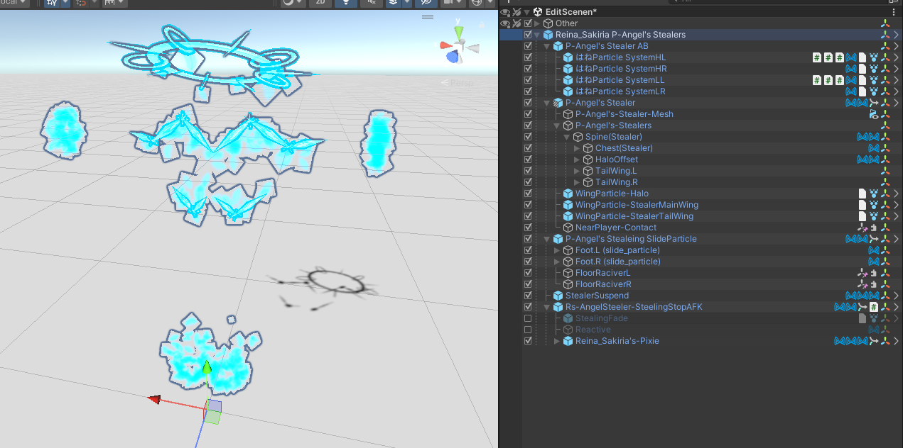



はね部分や光輪部分は [MA BoneProxy](https://modular-avatar.nadena.dev/docs/reference/bone-proxy) で取り付けられていて、いかなるアバターでも Humanoid であれば取り付けることが可能だったり

付け根の方にあたる、羽は子として他の部位を持つので、 [MA MoveIndependently](https://modular-avatar.nadena.dev/docs/reference/move-independently) で個別で動かせるようにしておいているため位置合わせがしやすくセットアップしてあったり

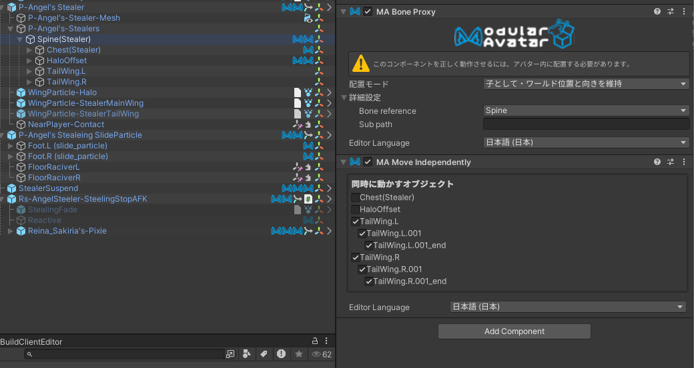

手首や足首に付与されるパーティクルも [MA BoneProxy](https://modular-avatar.nadena.dev/docs/reference/bone-proxy) を用いて取り付けられている。また、パーティクルのサイズを大まかに調節(放出する形状の大きさと放出量の自動調整)するツールがこのアクセサリ専用に作って取り付けられていたり

ほかにも、内容を完全にコピーするだけのコンポーネントや非常に雑に座標と回転を X 軸ミラーするものがあったり (X軸ミラーとか MA にあってもいいような気もするけど ... Issue にはあるのだろうか?)

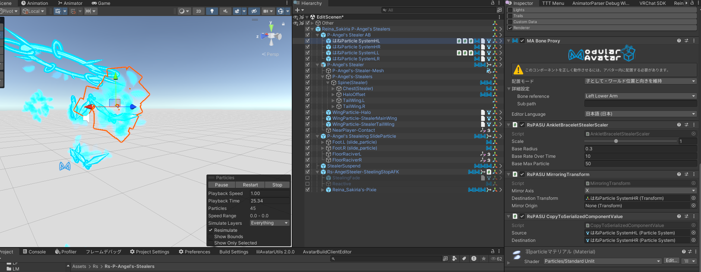

地面に経っているときなどでの移動時などに発生する、パーティクルは VRC の contact を コンストレイント で 上下だけ追従させずにくっつけることで地面に足が触れているかどうかをある程度適当に判定してたりする

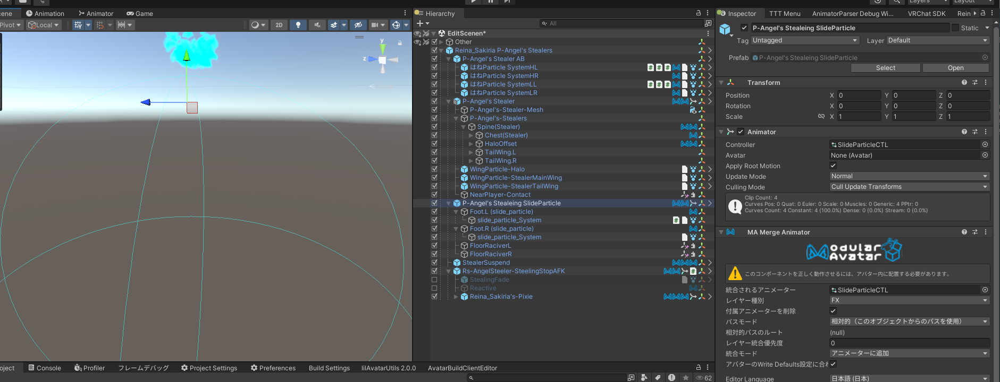

足の接地判定が外れている時、 PhysBone を使ってある程度の速度以上の 自由飛行 などによる移動が行われたことをパラメータにし、 音 が発生するようになっている

私の使う 自由飛行技術 の移動速度が高く、かつ、視野から抜けやすいため、ある程度耳をすませば位置把握ができるような形にする意図があって追加した経緯がある。

こういった 接近 を知らせる意図が強いため、可聴範囲は最大 2m (なお 現実的に聞こえる範囲は 1m あるかないか、かなり減衰が強くなるように鳴っているため) ある程度狭く、また、 Avatar Audio というのは通常非常に小さくされがちなので、人によっては全く聞こえないことも多いでしょうけれど、そのために大きくするような調整はしていないから、聞きたい人はある程度 Avatar の音量を大きくするといいかも。(Avatar Audio 100% で 50cm 以内ぐらいの距離感で人間の声ぐらいの音量に設定しているはず)

(ウィンド・ベル と呼ばれる物を 動画編集ソフト などを用いて加工した音が使用されているが ... もっといい音があるかもしれない)

すべてのパーティクルを消したり、音を消したりする キルスイッチ のようなものがある。けど実際に使ったことはほぼ無い。　ゲームワールドで足跡が残ると不利になるケースがあるが、気にせず戦うことが多いのも相まって使う機会がない。

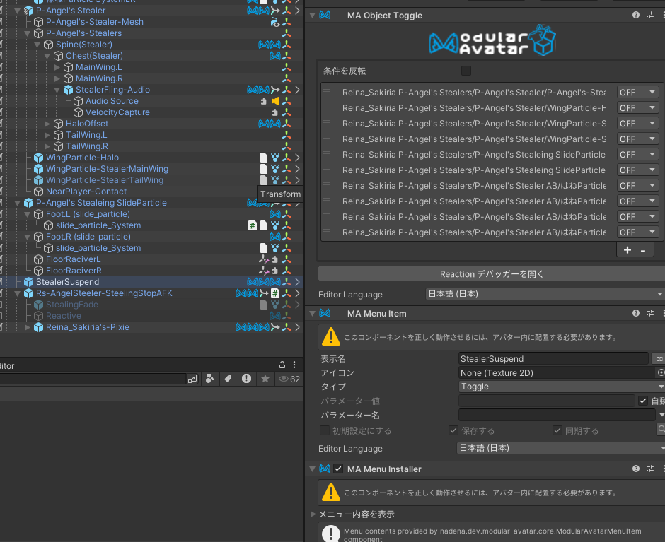



### 色・テクスチャ改変+α

かつて、 3体目までは ClipStudioPaint を使用して色改変をしていたが、[TexTransTool PSD Importer](https://ttt.rs64.net/docs/Reference/TexTransToolPSDImporter) を開発し始めて、実用可能になった段階から、 Reina_Sakiria の色改変から ClipStudioPaint は消えた。

髪をピンク色に染め(場合によっては角や爪も)、目を青く染める(余裕があったら青く光らせる)改変している。



色改変は、インポートされた PSD に対して [べたぬりレイヤー](https://ttt.rs64.net/docs/Reference/MultiLayerImageCanvas/SolidColorLayer) をクリッピングで追加する形で色を変えていることが多い。

髪の毛は、色合成 `オーバーレイ` を使用することが多く、目の色は `リニアライト` を使用していることが多い。ただ、それだけではいい色にならない場合は [レベル調整](https://ttt.rs64.net/docs/Reference/MultiLayerImageCanvas/LevelAdjustmentLayer)のガンマや範囲の調整をすることで整えたり、[色相・彩度](https://ttt.rs64.net/docs/Reference/MultiLayerImageCanvas/HSLAdjustmentLayer) などを併用していることもある。

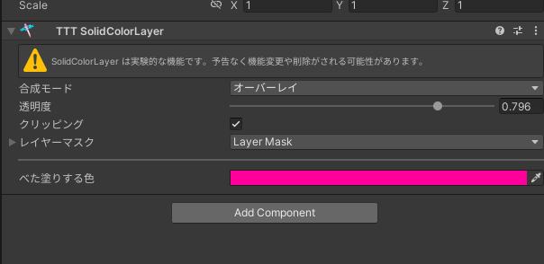

また、染まった 瞳は余裕がある場合、エミッションが設定される。 lilToon のエミッションは通常 `加算` で色が変わるけど、この改変は `通常` で色を変えるので、周囲の高原環境に影響を受けない発光をする特徴がある。(ここらへんは [疑天使の操り用具](https://github.com/ReinaS-64892/Reina-Sakiria-Character-Reference/blob/aadef23e5f3ef72614fd35937da3ffed56f17fbb/References/%E7%96%91%E5%A4%A9%E4%BD%BF%E3%81%AE%E6%93%8D%E3%82%8A%E7%94%A8%E5%85%B7.md) と揃うようにに調節している)

このとき、エミッションマスクが存在するアバターはそれを加工して `通常` でのエミッションで使えるようにする。 (lilToon の エミッションを `通常` で扱う場合、光らせたくない場所を黒くするのではなく、透明度を0にする必要があるため。) また、アバターにエミッションマスクが無いアバターは光らせたい部分だけのレイヤーを残してレイヤーを無効化し、`拡張色合成/カラー置き換え` でアルファを変えずに白くすることでマスクにしている。(たまに、レイヤーのオンオフでどうにか出来ない場合 SimpleDecal をレイヤーにしたり、 `_EmissionBlendMask` を対象に `拡張色合成/アルファ演算/アルファ減算` でアルファを削って誤魔化していることもある。)

マテリアルの調整が当然必要になるが [TTT MaterialModifier](https://ttt.rs64.net/docs/Reference/MaterialModifier) を使い、メインテクスチャを エミッション の 色 に割り当てて、 Assets を右クリックから `Create/TexTransTool/BlankTexture/512` などから生成し、エミッション の マスク に割当し、前述のマスク(MLIC)の置き換え先 の対象にすることでエミッションマスクを設定している。



### AFKのセットアップ

最近は AFKモーション をなければ(軽量化の都合で剥がれた場合も含め)作ったものを割り当て、AFKモーションが存在するアバターはそれを使用するようにしつつ、アバターをデフォルトの状態に戻すような AFKモーション を設定している。

自作


アバターが持っている AFK を継承




アバターをデフォルト状態に戻すのは、 Reina_Sakiria 専用のマテリアル生成&マテリアル置き換えアニメーション生成ツールによって行われている。

この時、色改変が TexTransTool によって行われ、テクスチャの改変が TTT にとって未知のコンポーネントが持つテクスチャには反映されないトリックを用いて、もとのテクスチャを持っておき、それを軽量化して複製したマテリアルに割り当て直し、AFK のパラメーターを基に差し替えるようなアニメーションコントローラーを生成することによって成り立っている。

また、その瞬間のための フラッシュ などの制御は事前に作成したアニメーションコントローラーを MA の力で結合する形になっているほか、 AFK 終了モーションを持つアバターのために、アバターの状態遷移を遅らせるような制御も行われている。(なお、アバターが標準で持つ AFK のアニメーションコントローラーは AFK への開始や終了が非常に遅いことが多く、終わるまでの時間をパラメーターに入れるのと同時に、短縮する改変をしていることも多い。)

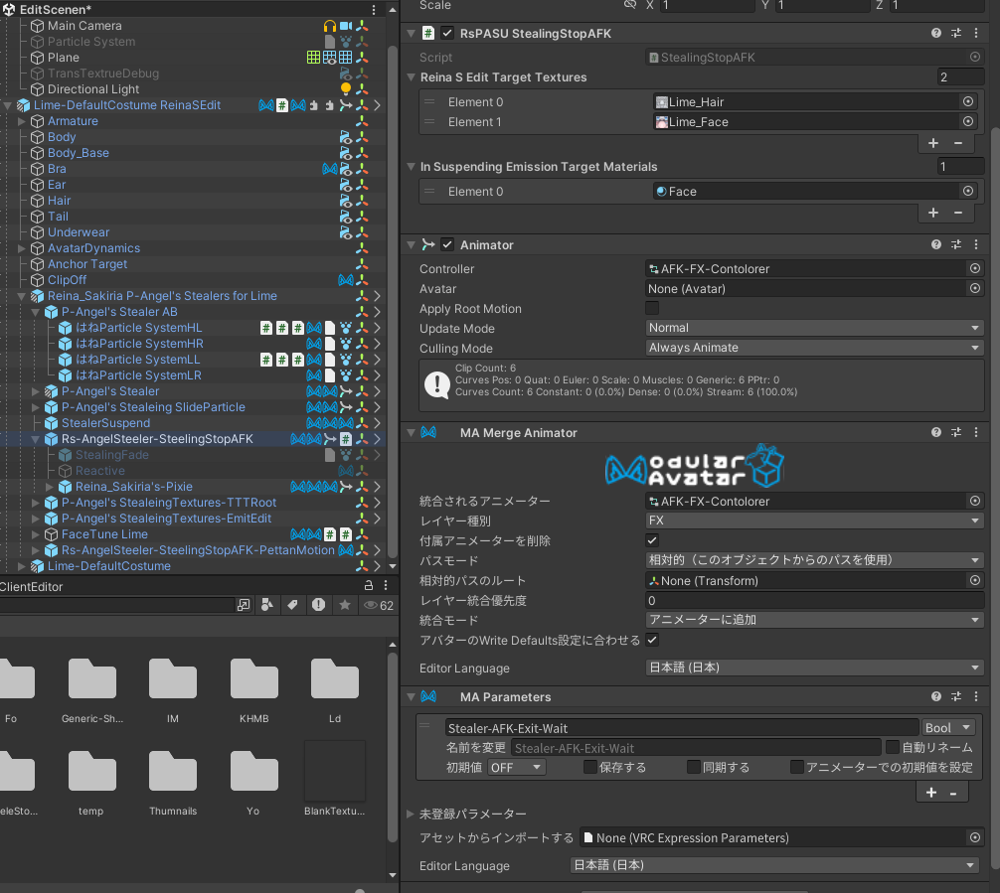

デフォルトに戻す処置を行う部分と、モーションは別のモジュールになるような設計になっていて、自作のものを用いる場合はこのようなプレハブを用意し、 Action レイヤーを置き換えて、 [FaceTune](https://github.com/Tliks/FaceTune) を用いて表情部分を再生するようにしている。

FaceTune に表情制御を任せることも多く、表情の表現を単独で別プレハブの形で持てるため重宝している。

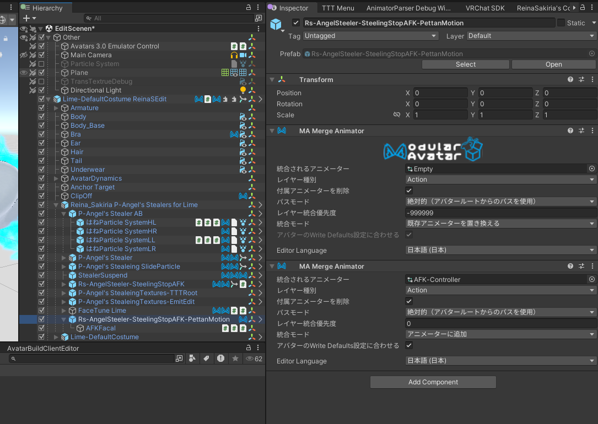



### 軽量化・全体的な調整

別にそんな面倒なことやってない。 __とりあえず [AAO Trace And Optimize](https://vpm.anatawa12.com/avatar-optimizer/ja/docs/reference/trace-and-optimize/) をつけよう。__ ぜんぶそれがどうにかしてくれる() 。

それと レンダラーのバウンスとかアンカーを整えるためにアバターのルートに [MA MeshSettings](https://modular-avatar.nadena.dev/docs/reference/mesh-settings) をつけると良き。

(バウンスとかアンカーを完全に統一しておくと、 [AAO T&O](https://vpm.anatawa12.com/avatar-optimizer/ja/docs/reference/trace-and-optimize/) の自動スキンメッシュレンダラー結合もより効きやすくなるので軽量化にもなる。)

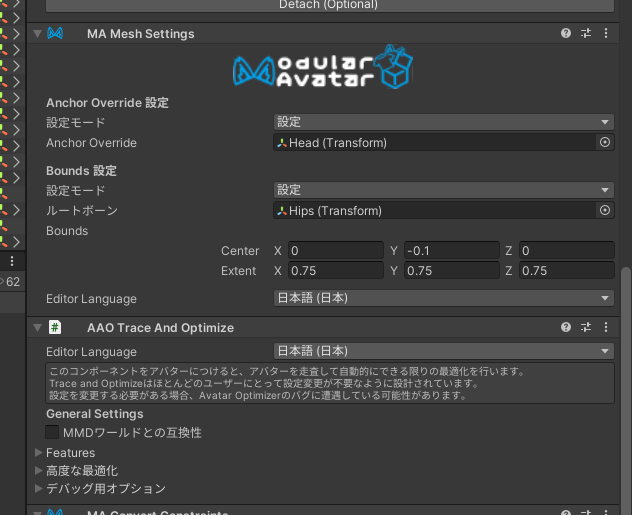



他にも、軽量化のために、衣装のトグルを破壊・消すことで [AAO T&O](https://vpm.anatawa12.com/avatar-optimizer/ja/docs/reference/trace-and-optimize/) の 自動スキンメッシュレンダラー結合 が非常に効きやすくなるようにしたり

[lilAvatarUtil](https://github.com/lilxyzw/lilAvatarUtils) を使って軽くテクスチャを見て、 4k テクスチャを [TTT TextureConfigurator](https://ttt.rs64.net/docs/Reference/TextureConfigurator) を用いて、2k に落とす設定を追加したりといった調節をしている。

書くことがないね、[TTT AtlasTexture](https://ttt.rs64.net/docs/Reference/AtlasTexture) といった、重めの手動設定系、軽量化ツールは普段から使用しているわけではなく アバターパフォーマンスランク を Medium にしたい時ぐらいにしか使用していない。

(元来 [TTT AtlasTexture](https://ttt.rs64.net/docs/Reference/AtlasTexture) は軽量化ツールの中でも最終手段として設計されていて、無理に使う必要はない。)



### 衣装のきせかえ・素体バリアント

ここまで綴ってきた手順は、最後の工程(軽量化・全体的な調整)以外は、ほぼすべてがモジュール化可能なので、モジュールにして`デフォルト衣装プレハブ`と`きせかえプレハブ`に差し込んで、同じ改変が適用されているが根本が違うプレハブが発生したりする。

余裕がある場合は、デフォルト衣装を剥がして MA を使って着せ直すことで、根本の改変を一つの `きせかえプレハブ` にすることもあるが、あんまりやってない。(この世のすべてのアバターが MA ある時だけ用でもいいから、デフォルト衣装単体のプレハブを用意してほしい ! (願望))

## おわり

ほら ... 大した改変、してないでしょ！

[疑天使の操り用具]:https://github.com/ReinaS-64892/Reina-Sakiria-Character-Reference/blob/aadef23e5f3ef72614fd35937da3ffed56f17fbb/References/%E7%96%91%E5%A4%A9%E4%BD%BF%E3%81%AE%E6%93%8D%E3%82%8A%E7%94%A8%E5%85%B7.md
