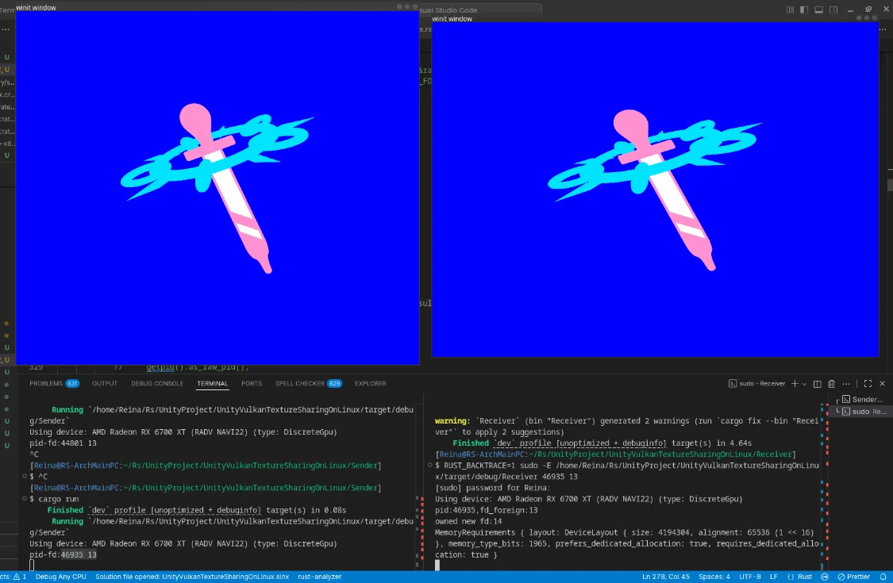

+++
date = '2025-11-11T14:35:49+0900'
title = 'Unity から GPU メモリを引き出したかった'
+++

## はじめに

これは、 Reina_Sakiria が Linux で、違うプロセス間で GPU 上のメモリの共有が本当に可能なのかの実証実験と、 [UnityEditor] から [Vulkan] のメモリを別のプロセスの [Vulkan] に引き抜きたかったその死闘を軽く書き綴ったものになります。

また[このレポジトリ](https://github.com/ReinaS-64892/UnityVulkanTextureSharingOnLinux)の話になります。

## [Vulkan] to [Vulkan] の共有

これを試す前に [Unity] からすぐに引き出そうと戦っていたわけですが、 [Unity] を セグフォで殺し続けていたため、まずは、自ら [Vulkan] を使ったテストプログラムを作ってて実証しそれを [Unity] とつなぐ形を取ろうと思いました。

### [winit] なんもわからん ついでに [ash] もわからん

まずは [ash] と [winit] をつかって ... やろうとしたんですが、 [winit] の情報を調べると v0.30.x の情報と v0.29.x or それ以前 の情報が混在しており、どうすればいいのか何もわからず、Window を出すことすらままなりませんでした。(なんなら、 git の最新版はまた変わっているようで何もわかりません。)

[rust] で使える かなり薄い [vulkan] のラッパーであるところの [ash] を使って、できるかなと思ったんですが、[ash] を使ったチュートリアルも何もわからなかったので一旦諦めました。([ash] のチュートリアルでは [winit] のバージョンが違ったりしてもう最悪)

### [Vulkano]

[vulkan] を [ash] 越しに直に触っては セグフォや強制終了してしまったりとままならなかったので、一旦 [vulkan] を直に触るのを諦めようということで、 [rust] で使用できる [vulkan] の厚めの safe ラッパーであるところの [vulkano] を触ることにしました。

[vulkano] のレポジトリにあった example を見たところ、[winit] v0.30.x 系で実装されていて、かつサンプルも多いようで雑にサンプルをパチっても動き実験に必要ベースも整っていました。
(今回実験のベースとして使用した[サンプル](https://github.com/vulkano-rs/vulkano/tree/20b9c60c03db51cd2830664b100339d3fb20f68c/examples/image))

また、GPU 上の [vulkan] 同士のメモリ共有の要である [vulkan]拡張の [VK_KHR_external_memory_fd](https://docs.vulkan.org/refpages/latest/refpages/source/VK_KHR_external_memory_fd.html) を使用して、[OpenGL に渡すサンプル](https://github.com/vulkano-rs/vulkano/tree/20b9c60c03db51cd2830664b100339d3fb20f68c/examples/gl-interop)もあったため、こちらも参考にできるのもあるし、 [vulkano] にそれら拡張を使うことが可能であることがわかったためそれを使用することにしました。

[vulkano] へのインポートはあんまり情報が見つからなくて手探りだったのですが、少しいじったらコンパイルが通るようになって共有に成功しました。

(ここにたどり着くまで結構失敗し続けたんだけど、[vulkano] はバリデーションのおかげで事故っても panic するし、だめなところはエラーログを読めばある程度はわかるので、触っていたときの精神衛生は [ash] を触っているときよりもだいぶ良かったですね ... 私には [vulkan] を直に触るにはまだまだ知識が足らないというか、多分 [vulkan] を直に触っているときに [vulkan] の持つバリデーションなどの機能の有効化とかができてないから説もありますが。)

## [unity] から [vulkan] へ

Reina_Sakiria の目的としては [vulkano] で [vulkan] to [vulkan] のメモリ共有はできているので目的の半分は達成できています。([Unity] からの引き抜きもできたら当然嬉しい、だけど、 not [Unity] 環境であってもできることが実証できれば、私はそれを使いたかったから。)

でも、 [Unity] から引き抜いたら楽しそう！ (これが 死闘 の始まりでした。)

### [Unity Native Plugin](https://docs.unity3d.com/6000.0/Documentation/Manual/native-plugin-interface.html)

Native Plugin っていっても low-level な [Unity] の Interface を掴むタイプの。

Interface を受け取ると行っても、 c++ じゃないときつそうだったので、なくなく c++ を書くことにしました。けど、 C++ ってどうやってコンパイルするんだろう ... ?

フレンドに聞いたところ、 `cargo` みたいないい感じ手段はないって言われました ... (?) どうやら使いたい[コンパイラーにファイルを引数](https://github.com/ReinaS-64892/UnityVulkanTextureSharingOnLinux/blob/5eef5af9417110ee4fcf71525f557c2e1402fbad/Assets/UnityVulkanTextureShareingOnLinux/cpp~/Build.sh)で渡すと出してくれるらしい。

えぇ ...

余り知らない言語であるところの c++ を [Unity の NativeRenderingPlugin example](https://github.com/Unity-Technologies/NativeRenderingPlugin/tree/f703c47a140d343c2c863a36d1aa5832586f3aaa/PluginSource/source)をパチる&参考に 適当に書いて、[vulkan] のメモリをアロケーションして、公開させて fd(linux (POSIX ... ?) の file descriptor) を取得するところまでは簡単 ... ?

(そうかな ... セグフォして Unity が死ぬし 何が原因なのかわからんし... メモリ安全じゃない世界ってなんだよ ... 少し手違いしただけですぐ死ぬじゃん、[rust] の パニック や dotnet C# の exception がいかにちゃんとログを吐いてわかりやすい環境にあってくれているかをとても再確認するよね ... 可能な限りメモリ安全の世界からでたくないね)

まぁどうにかなりました、問題はここから。

### [vkCmdCopyImage](https://docs.vulkan.org/refpages/latest/refpages/source/vkCmdCopyImage.html)

アロケーションしたメモリ(fd 公開用)を自分で作った [VkImage](https://docs.vulkan.org/refpages/latest/refpages/source/VkImage.html) にバインドして、 [vkCmdCopyImage](https://docs.vulkan.org/refpages/latest/refpages/source/vkCmdCopyImage.html) で共有して [Unity] 側 は終わりかな ... ? と思ったんですが話はそう簡単に行きませんでした。

C# コードから、 RenderTexture の native ptr を渡して、[vkCmdCopyImage](https://docs.vulkan.org/refpages/latest/refpages/source/vkCmdCopyImage.html) 叩いて ... コード自体は[参考](https://github.com/Unity-Technologies/NativeRenderingPlugin/blob/f703c47a140d343c2c863a36d1aa5832586f3aaa/PluginSource/source/RenderAPI_Vulkan.cpp#L708-L734)にできたものがあり、すぐできたんですが、 `invalid command buffer` になって発行に失敗したり、発行したら Unity が(セグフォして)死んだり。

[unity] の [vulkan] の interface にある [CommandRecordingState] の引数を変えてみたりしていじっていたんですが、セグフォして死ぬか、コマンドバッファーが `null ptr` になってどうすればいいのかわかりませんでした。

また ... 流石に自ら `command buffer pool` をつくって `command buffer` を作るのを [vulkan] 直だたきでやるのはきつそうだったので一旦諦めることにしました。

Unity なんもわからん。 このプロジェクトはおそらく [vkCmdCopyImage](https://docs.vulkan.org/refpages/latest/refpages/source/vkCmdCopyImage.html) をどうにか発行できれば完全に成功していたと思います。

(今思うと ... 何かが足りなかった([vkBindImageMemory](https://docs.vulkan.org/refpages/latest/refpages/source/vkBindImageMemory.html) の実行とか ... ? そんな)気がするのでもう一度やればうまく行く気はしなくもないです。)

### [vkBindImageMemory](https://docs.vulkan.org/refpages/latest/refpages/source/vkBindImageMemory.html)

この方法は [VK_KHR_external_memory_win32](https://docs.vulkan.org/refpages/latest/refpages/source/VK_KHR_external_memory_win32.html) で近いところまでやってのけていた、[先駆者の方法](https://discussions.unity.com/t/sharing-texture-between-process-via-gpu-shared-memory-in-vulkan/1581773)を真似たものになります。

そのの手法とは ... [Unity] が作った [VkImage](https://docs.vulkan.org/refpages/latest/refpages/source/VkImage.html) に対して後から [vkBindImageMemory](https://docs.vulkan.org/refpages/latest/refpages/source/vkBindImageMemory.html) を実行しメモリを差し替える！！！

なんと治安が悪い！

でも結果的に、壊れてはいますが動きはしました。



でもなんで壊れているんでしょうね ... ? まぁこんな治安の悪いやり方をしたので当然と言えば当然だと思います。

フレンドと話していたところおそらくこれは [Z階数曲線](https://ja.wikipedia.org/wiki/Z%E9%9A%8E%E6%95%B0%E6%9B%B2%E7%B7%9A) によってエンコードされているのがそのまま出てきてしまっているのではないか ... という話になりました。

([vulkano] 同士のとき 画像の中身のレイアウトをどうあつかうのかをずらしても壊れなかったので fd で公開する設定をつけたときに [VkImage](https://docs.vulkan.org/refpages/latest/refpages/source/VkImage.html) になんらか特殊な設定でも入るのかな、もしかして[これ(VkExternalMemoryImageCreateInfo)](https://docs.vulkan.org/refpages/latest/refpages/source/VkExternalMemoryImageCreateInfo.html)を [VkImage](https://docs.vulkan.org/refpages/latest/refpages/source/VkImage.html) を作るときに渡さないと壊れるのではないか ... ? それで Unity の作った [VkImage](https://docs.vulkan.org/refpages/latest/refpages/source/VkImage.html) にはそれがないから壊れる ... とか ... ? あくまで未検証で可能性だけど ... )

## おわり

結局、 Reina_Sakiria はこのブログを書いている現時点では [Unity] からの GPU メモリ共有には完璧に成功はできませんでした。

けど、 Linux でも [spout](https://spout.zeal.co/) のような プロセスを超えた GPU 上のメモリ共有が不可能ではないということが実証できたので一旦それで満足しています。

また[この実証レポジトリ](https://github.com/ReinaS-64892/UnityVulkanTextureSharingOnLinux) は他者の環境で動くかわかんないけど公開しているので、よかったら見ていってね！

それじゃ ... またね！

[rust]: https://rust-lang.org/
[vulkano]: https://github.com/vulkano-rs/vulkano
[vulkan]: https://www.vulkan.org/
[ash]: https://github.com/ash-rs/ash
[winit]: https://github.com/rust-windowing/winit
[unity]: https://unity.com/
[unityeditor]: https://unity.com/
